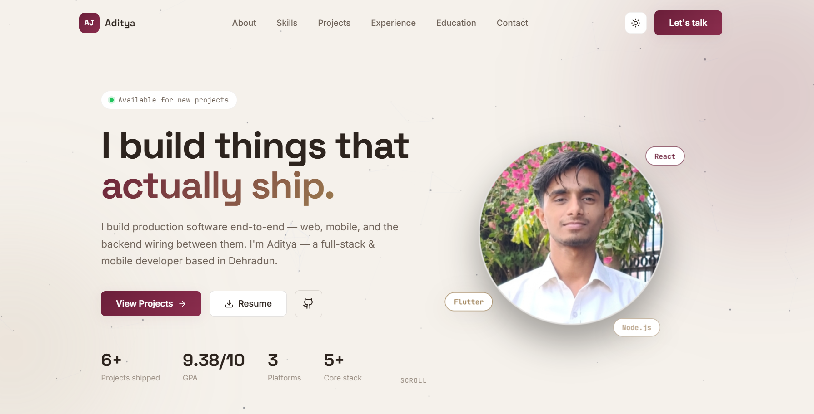

<div align="center">

<h1>Hi, I'm Aditya Jaiswal</h1>


<p>
  <a href="https://mail.google.com/mail/?view=cm&fs=1&to=ajaditya1908@gmail.com"></a>
  <a href="https://www.linkedin.com/in/aditya-jaiswal-b71047363/"></a>
  <a href="https://portfolio-page-neon.vercel.app/"></a>
  <a href="https://x.com/ajaditya1908"></a>
  <a href="https://github.com/aj-aditya19"></a>
</p>



<a href="https://github.com/aj-aditya19">
  
</a>

</div>

<br/>

## About Me

```yaml
Name: "Aditya Jaiswal"
Born: 2008
Education: "BCA (Final Year) @ The ICFAI University, Uttarakhand — CGPA 9.10/10"
Focus: "Full-Stack Development, Flutter, System Design"
DSA: "700+ problems solved"
Hackathons: "Participated in 3+ National Level hackathons"
Winner: "Winner of Senior Year Coding Competition"
Philosophy: "Ship real, deployable products — not just prototypes"
Fun Fact: "Builds a Chrome extension when Instagram gets too tempting during DSA grind"
```

---

## Tech Stack

<div align="center">

**Languages**
<br/>


**Frameworks & Runtime**
<br/>


**Databases & Cloud**
<br/>


**Tools**
<br/>


</div>

---

## Current Goals

- Strengthening Data Structures & Algorithms
- Building production-level full-stack & mobile projects
- Improving backend & system design skills
- Exploring Cloud, DevOps, and scalable architectures
- Contributing to open source

---

## Featured Projects

<table>
<tr>
<td width="50%" valign="top">

### [AI Interview Assistant](https://github.com/aj-aditya19/AI-Interview-Assistant)
Real-time AI-powered interview platform with voice interaction, AI scoring, and live proctoring.
- Face-detection proctoring (face-api.js) + Python/Whisper microservice for filler-word detection
- Dynamic interview generation via Groq
- 7-collection MongoDB schema

`React` `Node.js` `MongoDB` `Groq` `Whisper` `OpenCV`

</td>
<td width="50%" valign="top">

### [BingoGame](https://github.com/aj-aditya19/BingoGame)
Real-time multiplayer Bingo game built on WebSockets.
- Live multiplayer sync via Socket.io
- JWT-based auth
- Node.js + Redis backend

`Node.js` `Socket.io` `Redis` `JWT`

</td>
</tr>
<tr>
<td width="50%" valign="top">

### [MyVault](https://github.com/aj-aditya19/MyVault)
Local-first Flutter productivity app with AES-256 encryption.
- PIN-locked sensitive sections
- Study tracker with `fl_chart` visualizations + 70-day heatmap
- Daily task manager with priorities, reminders & tags
- Adaptive shell — NavigationBar on phone, NavigationRail on tablet/desktop

`Flutter` `Dart` `AES-256` `fl_chart`

</td>
<td width="50%" valign="top">

### [DeepWork — Chrome Extension](https://github.com/aj-aditya19/deepwork)
Blocks distracting sites on a custom weekly schedule — 100% offline, no server.
- Runs fully inside Chrome via `declarativeNetRequest` (Manifest V3)
- Custom block list + day/time scheduling, syncs via `chrome.storage.sync`
- Built to learn Chrome extension architecture from the ground up

`JavaScript` `Chrome Extension APIs` `Manifest V3`

</td>
</tr>
</table>

---

## Working On

**Live Location Sharing System**
Permission-based real-time location sharing platform with secure friend connections, live tracking, Socket.IO integration, and Google Maps support.

`React` `Node.js` `Socket.IO` `Google Maps API`

---

## GitHub Stats

<div align="center">


</div>

---

## Pinned Repositories

<div align="center">
<table>
<tr>
<td width="25%" align="center">

**[AI Interview Assistant](https://github.com/aj-aditya19/AI-Interview-Assistant)**
<br/>
`React` `Node.js` `MongoDB`

</td>
<td width="25%" align="center">

**[MyVault](https://github.com/aj-aditya19/MyVault)**
<br/>
`Flutter` `Dart`

</td>
<td width="25%" align="center">

**[BingoGame](https://github.com/aj-aditya19/BingoGame)**
<br/>
`Node.js` `Socket.io`

</td>
<td width="25%" align="center">

**[DeepWork](https://github.com/aj-aditya19/deepwork)**
<br/>
`JavaScript` `Chrome APIs`

</td>
</tr>
</table>
</div>

---

<div align="center">

### Thanks for stopping by!

Feel free to explore my repos, connect on [LinkedIn](https://www.linkedin.com/in/aditya-jaiswal-b71047363/), or check out my [portfolio](https://portfolio-page-neon.vercel.app/). Always open to interesting projects and Agentic AI opportunities.

</div>
